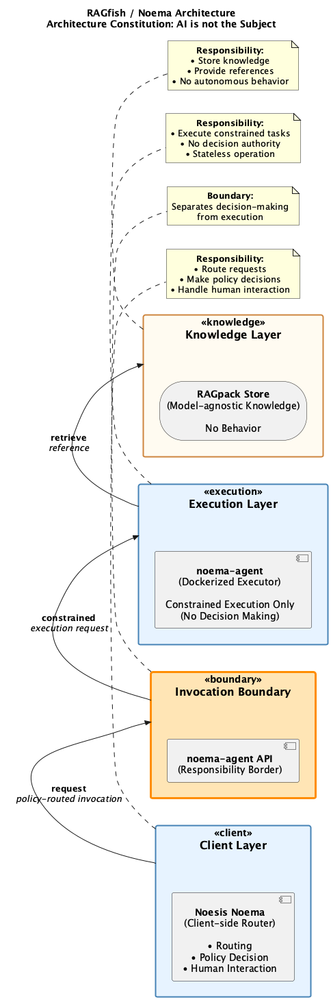
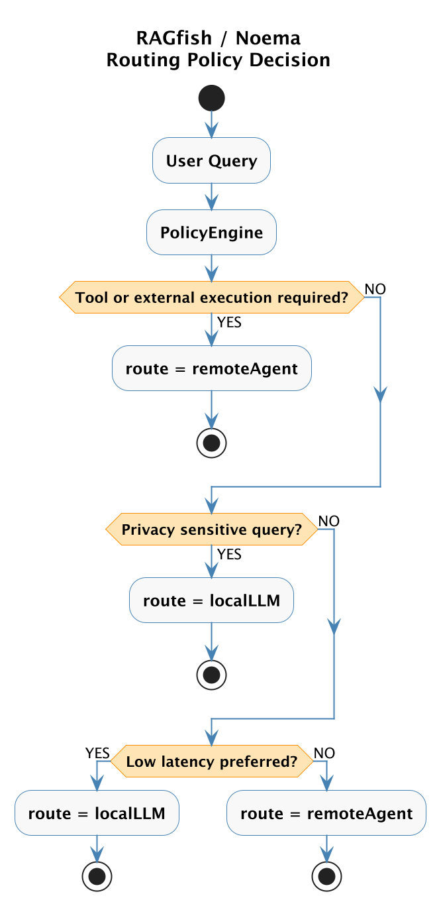
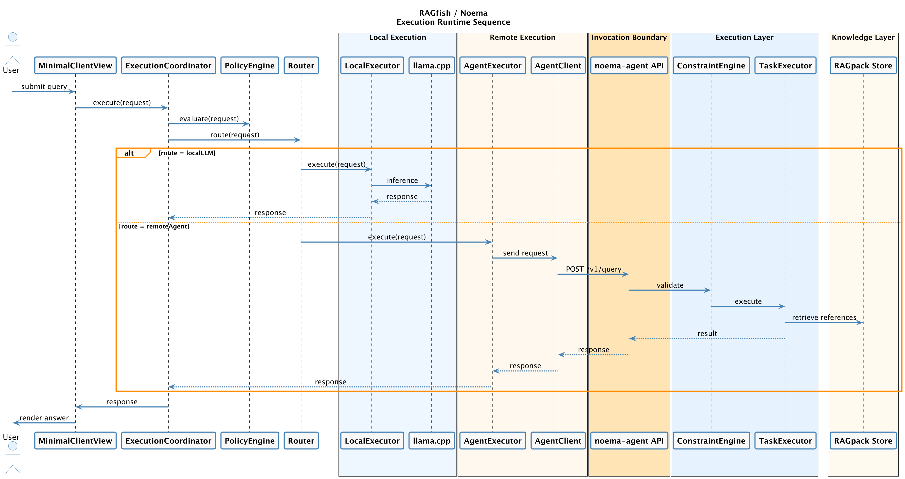

# RAGfish

**RAGfish** is the reference implementation of the **Noema Architecture** — an AI runtime design that strictly separates **decision**, **execution**, and **knowledge**.

The project implements the architectural principle:

> **AI is not the subject.**
> AI is a tool executed under human‑controlled policy.

This repository contains the architectural documentation and implementation artifacts for the Noema runtime model.

---

# Architecture Overview

The system is divided into three core layers:


| Layer           | Responsibility                     |
| --------------- | ---------------------------------- |
| Client Layer    | Decision making and routing        |
| Execution Layer | Constrained task execution         |
| Knowledge Layer | Storage and retrieval of knowledge |

These layers are separated by explicit **boundaries** so that no single component can both decide and execute.

---

# System Architecture

The following diagram describes the overall architecture.



Key principles:

- Decision authority exists only in the **client runtime**
- Execution agents are **stateless and constrained**
- Knowledge stores contain **no behavior**
- Routing decisions are explicit and auditable

---

# Routing Policy Decision

The **PolicyEngine** determines where a query should be executed.

Routing decisions are based on runtime policy signals such as:

- Tool or external execution requirements
- Privacy sensitivity
- Latency preferences



Example outcomes:

```
localLLM      → execute locally using llama.cpp
remoteAgent   → execute via noema-agent
```

The router itself performs **no decision logic**. It only maps policy results to execution routes.

---

# Execution Runtime Sequence

The following sequence diagram illustrates how a request moves through the system.



Execution flow:

1. User submits query
2. Client UI forwards request to ExecutionCoordinator
3. PolicyEngine evaluates execution conditions
4. Router selects execution route
5. Request executes locally or via remote agent
6. Execution layer retrieves references from RAGpack store
7. Response is returned to the client

---

# Architecture Documentation

The following documents define the Noema Architecture and Project v2:

| Document | Purpose |
|----------|---------|
| [Project Charter v2](docs/noema/project/PROJECT-CHARTER-v2.md) | Vision, mission, principles, and success criteria for Project v2 |
| [Execution Roadmap v2](docs/noema/project/EXECUTION-ROADMAP-v2.md) | Capability themes, execution order, dependency matrix, and AI collaboration model |
| [ADR-0001: Noema Architecture](docs/noema/adr/ADR-0001-noema-architecture.md) | Four-repo structure and responsibility boundaries |
| [ADR-0002: Noema Governance Pipeline](docs/noema/adr/ADR-0002-noema-governance-pipeline.md) | How the system evaluates, routes, executes, and produces verifiable outcomes |
| [Human-Governed Development Loop](docs/noema/human-governed-loop.md) | Task lifecycle, branch naming, issue and PR discipline |
| [Concept Note 0001 — Dialogue Engineering](docs/noema/concepts/CONCEPT-0001-dialogue-engineering.md) | Engineering concept: optimising shared understanding across human-AI dialogue |
| [Design — Dialogue Engineering Framework v0](docs/noema/design/DESIGN-dialogue-engineering-framework-v0.md) | Framework design: lifecycle, mathematical model, artifact transformation, and UML diagrams |

---

# Repository Structure

```
RAGfish/
 ├ docs/
 │  ├ diagrams/
 │  │   architecture-standalone.puml
 │  │   architecture-standalone.png
 │  │   routing-decision.puml
 │  │   execution-sequence.puml
 │  │
 │  └ assets/
 │      routing-policy-decision.png
 │      execution-runtime-sequence.png
 │
 ├ NoesisNoema/
 │    Swift client runtime
 │
 ├ noema-agent/
 │    Constrained execution runtime
 │
 └ noesisnoema-pipeline/
      RAGpack generation tools
```

---

# Core Components

## Client Layer (Decision Layer)

```
MinimalClientView
ExecutionCoordinator
PolicyEngine
Router
LocalExecutor
AgentExecutor
AgentClient
```

Responsibilities:

- Evaluate policy
- Route execution
- Manage human interaction

The client runtime is the **only decision authority**.

---

## Invocation Boundary

The invocation boundary prevents execution layers from influencing decision logic.

```
AgentClient → noema-agent API
```

This boundary ensures that the execution environment cannot modify routing decisions.

---

## Execution Layer

```
ConstraintEngine
TaskExecutor
```

Responsibilities:

- Validate requests
- Execute tasks
- Remain stateless

The execution layer has **no decision authority**.

---

## Knowledge Layer

```
RAGpack Store
```

Responsibilities:

- Store chunked knowledge
- Provide retrieval references

The knowledge layer has **no behavior**.

---

# Execution Routes

Two execution paths currently exist:


| Route       | Description                   |
| ----------- | ----------------------------- |
| localLLM    | Local inference via llama.cpp |
| remoteAgent | Execution through noema-agent |

Routing decisions are made by the PolicyEngine and mapped by the Router.

---

# Design Principles

The Noema architecture follows several strict rules:

1. **AI cannot decide.** Only policy code may decide.
2. **Execution must be constrained.** Agents cannot autonomously act.
3. **Knowledge must be passive.** Knowledge systems do not contain logic.
4. **Routing must be explicit.** All execution paths are observable.

These rules prevent uncontrolled agent behavior and keep the system deterministic.

---

# Development

Typical development flow:

```
git checkout main

git checkout -b feature/epicX

# implement

git commit

git push

# open PR
```

---

# Current Architecture Phase

The project is currently implementing:

**EPIC4 — Routing & Hybrid Execution**

This phase introduces:

- Policy-based routing
- Local vs remote execution
- Hybrid runtime orchestration

---

# Future Work

Planned improvements include:

- Advanced routing policies
- Cost-aware routing
- Privacy-aware execution
- Model selection policies

---

# License

TBD
