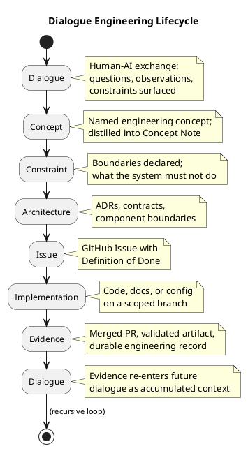
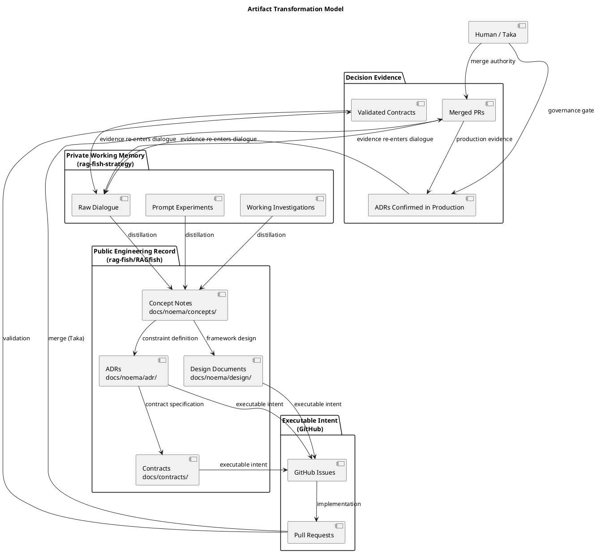
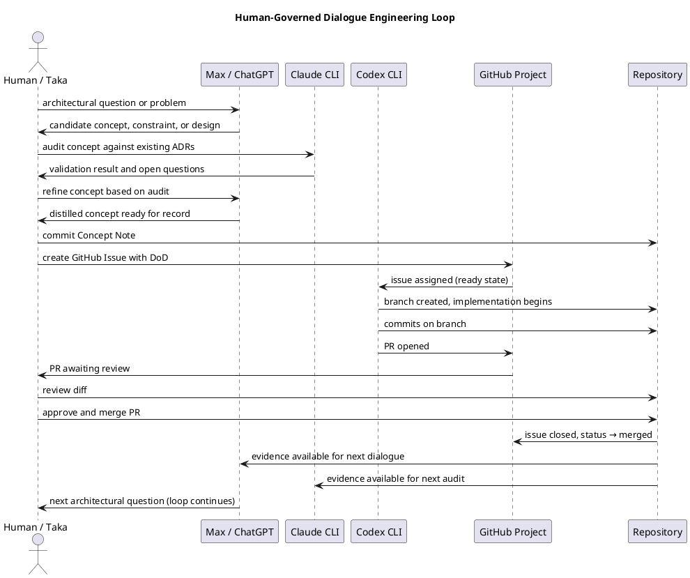

# Design Document — Dialogue Engineering Framework v0

**Status:** Draft  
**Date:** 2026-07-01  
**Project:** Hermes  
**Owner:** Claude CLI  
**Scope:** Architectural framework — no runtime implementation prescribed

---

## Summary

Dialogue Engineering is the generative process that transforms human-AI dialogue into durable engineering artifacts.

Where Prompt Engineering optimises individual prompts for better immediate model outputs, Dialogue Engineering optimises the sustained process by which humans and AI systems build shared architectural understanding — producing concepts, constraints, decisions, and implementation that enter the permanent engineering record.

This document defines the Dialogue Engineering Framework v0: its lifecycle, mathematical model, artifact transformation model, and relationship to Project Hermes. It is a framework document, not an implementation specification. It does not define runtime APIs, policy engine internals, or model selection logic.

---

## Core Lifecycle

Dialogue Engineering operates as a recursive engineering loop. Each stage produces an artifact that becomes the input for the next stage, and the final stage produces evidence that re-enters future dialogue.

```
Dialogue
    │
    ▼
Concept
    │
    ▼
Constraint
    │
    ▼
Architecture
    │
    ▼
Issue
    │
    ▼
Implementation
    │
    ▼
Evidence
    │
    ▼
Dialogue
```

The loop is intentionally recursive. Evidence produced by implementation — merged PRs, validated contracts, ADRs confirmed by production — becomes the context that informs the next round of dialogue. Each iteration improves the shared engineering model.

### Stage Responsibilities

| Stage | Input | Output |
|-------|-------|--------|
| **Dialogue** | Questions, constraints, observations | Concepts and clarified intent |
| **Concept** | Raw dialogue insight | Named, documented engineering concept |
| **Constraint** | Accepted concept | Boundaries declared before implementation |
| **Architecture** | Constraints and concepts | ADRs, contracts, component boundaries |
| **Issue** | Architectural decision | Executable GitHub Issue with Definition of Done |
| **Implementation** | Scoped Issue | Code, docs, or configuration on a branch |
| **Evidence** | Merged PR | Durable artifact: ADR, test result, deployed artefact |
| **Dialogue** | Evidence and open questions | Next iteration begins |

---

## Mathematical Model

### LLM Probability Foundation

Modern large language models are autoregressive probabilistic generators. At inference time, a model generates a token sequence by recursively sampling from a conditional probability distribution:

$$P(x_{1:N}) = \prod_{t=1}^{N} P(x_t \mid x_{1:t-1}, \theta)$$

Where:

- $x_{1:N}$ is the generated token sequence
- $x_t$ is the token generated at step $t$
- $x_{1:t-1}$ is all tokens generated before step $t$ (context)
- $\theta$ represents the model's learned parameters

The model is and remains probabilistic. Successive invocations with identical input may produce different outputs. Dialogue Engineering does not attempt to eliminate this — it treats the probabilistic nature of language generation as a foundation, not an obstacle.

### Dialogue Engineering Transformation

Dialogue Engineering transforms accumulated dialogue, constraints, and evidence into an evolving architectural state. The transformation is defined as:

$$A_t = F(D_{0:t},\ C_t,\ E_t)$$

Where:

- $D_{0:t}$ = accumulated dialogue from session 0 through the current session $t$
- $C_t$ = constraints declared and active at time $t$
- $E_t$ = evidence available at time $t$ (merged PRs, validated ADRs, observed failures)
- $A_t$ = architectural state at time $t$

As dialogue accumulates, as constraints are refined, and as evidence grows, the architectural state evolves. The function $F$ is not a closed-form equation — it is the governed engineering process defined in this framework.

This is an architectural model, not a mathematical proof. Its purpose is to make explicit that architectural state is a function of accumulated context, not of any single prompt or session.

### Decision Consistency

Given a probabilistic language foundation, Hermes pursues consistent decisions rather than deterministic language generation. The consistency model is:

$$\text{Decision}_t = \text{Consistency}(K_t,\ I_t,\ X_t)$$

Where:

- $K_t$ = knowledge base at time $t$ (trust-evaluated, version-controlled)
- $I_t$ = invariants at time $t$ (declared constraints, Route Contracts, governance rules)
- $X_t$ = runtime context at time $t$ (request, session state, active policy)

A decision is consistent when it applies the same knowledge, respects the same invariants, and operates in the same runtime context. This consistency is achievable in a governed system even when the underlying language model is probabilistic — because the inputs to the decision function are controlled, not the model's token sampling.

These equations are architectural models. They describe the structure of the engineering process, not a formal mathematical system with provable properties.

---

## PlantUML Diagrams

### Diagram 1 — Dialogue Engineering Lifecycle



### Diagram 2 — Artifact Transformation Model



### Diagram 3 — Human-Governed Loop



---

## Framework Responsibilities

The Dialogue Engineering Framework assigns a distinct purpose to each stage of the lifecycle. These responsibilities are not negotiable — they define what each stage produces and what it does not produce.

**Dialogue produces concepts.**  
A dialogue session surfaces candidate concepts, clarifies assumptions, and resolves ambiguities between collaborators. The output is not a decision — it is a concept candidate ready for documentation.

**Concepts become constraints.**  
A documented concept names the thing and defines its boundaries. Boundaries become constraints: declarations of what the system must not do, regardless of capability. Constraints precede architecture.

**Constraints shape architecture.**  
Architectural decisions are bounded by the constraints declared in prior stages. An ADR that violates a declared constraint is not a valid architectural decision — it requires either a constraint revision (with documented rationale) or rejection.

**Architecture generates issues.**  
Every architectural decision that requires implementation produces one or more GitHub Issues. Issues carry the Definition of Done derived from the architectural intent. Architecture without Issues is intent without executable commitment.

**Issues guide implementation.**  
Implementation is scoped to the Issue. The branch, the PR, and the code are bounded by what the Issue defines. Scope expansion requires a new Issue — not an expanded PR.

**Implementation creates evidence.**  
A merged PR is evidence. A validated contract is evidence. A passing test suite is evidence. Evidence is a durable artifact that can be traced, reproduced, and referenced in future dialogue. Implementation without evidence is not a governed decision.

**Evidence updates future dialogue.**  
Evidence is the mechanism by which the architecture learns from itself. Merged PRs, confirmed ADRs, and observed failures all enter the next dialogue session as accumulated context. The loop closes and begins again.

---

## Relationship to Hermes

Dialogue Engineering is not a feature of Project Hermes. It is the generative principle behind Hermes.

Hermes capabilities — Governance, Trust, Evidence, Performance, Observability, and Multi-Model Orchestration — are not designed in isolation. They are produced through the Dialogue Engineering loop. Each capability theme emerges from accumulated dialogue, is constrained by declared invariants, is decided in ADRs, is committed to GitHub Issues, and is implemented and validated through PRs.

The architecture of Hermes is itself evidence that the Dialogue Engineering loop works. The Project Charter, the ADRs, the contracts, the Human-Governed Development Loop — all of these entered the engineering record through dialogue sessions that followed this framework, whether or not it was formally named at the time.

This document formalises what was already happening. It gives the process a name, a structure, and a mathematical model so that future Claude and Codex sessions can operate within it explicitly rather than rediscovering it through implicit practice.

### Hermes Capability Themes and the Loop

| Capability Theme | How the Loop Produces It |
|-----------------|--------------------------|
| **Governance** | Constraints declared in dialogue → ADRs → policy contracts → governance pipeline |
| **Trust** | Concept of trust-evaluated knowledge → ADR-0002 → TrustEvaluator component → Issue → implementation |
| **Evidence** | Requirement for durable artifacts → constraint → Route Contract evidence field → Issue → EvidenceStore |
| **Performance** | Latency observations in dialogue → constraint (no latency tax) → architectural decision → benchmark-driven Issue |
| **Observability** | Governance requirement → constraint → structured logging ADR → Issue → implementation |
| **Multi-Model Orchestration** | Architectural dialogue → ADR-0001 → four-repo structure → routing contracts → Issues per repo |

---

## Relationship to Working Memory

Not all dialogue output is public architectural knowledge. The Dialogue Engineering Framework defines where each artifact type belongs.

### Private Working Memory (rag-fish-strategy)

Raw prompts, detailed dialogue history, prompt experiments, working investigations, and exploratory sketches belong in the private strategy repository. These are the raw material of Dialogue Engineering — valuable to the team, not yet distilled into public knowledge. Private working memory is not version-controlled in public repositories.

### Public Engineering Record (rag-fish/RAGfish)

Only distilled engineering knowledge enters the public repositories:

| Artifact Type | Location |
|--------------|----------|
| Concept Notes | `docs/noema/concepts/` |
| ADRs | `docs/noema/adr/` |
| Design Documents | `docs/noema/design/` |
| Contracts and Schemas | `docs/contracts/` |
| Architecture Documents | `docs/architect/` and `docs/architecture/` |

### Executable Intent (GitHub)

GitHub Issues carry the executable intent derived from architectural decisions. Pull Requests carry the implementation and produce evidence on merge.

The discipline of this separation — dialogue in private, distilled knowledge in public, executable intent in GitHub — prevents the public engineering record from becoming a dump of exploratory reasoning. The public record contains decisions and evidence. The private record contains the process.

---

## Non-Goals

This document does not define:

- Runtime APIs for any Hermes capability
- Policy engine internals or evaluation logic
- Routing algorithm design or model selection criteria
- UI or interaction design for any Hermes component
- Implementation timelines or sprint planning

These are addressed in ADRs, contracts, and GitHub Issues produced by the Dialogue Engineering loop. This document defines the loop itself, not its outputs.

---

## Related Documents

- [Concept Note 0001 — Dialogue Engineering](../concepts/CONCEPT-0001-dialogue-engineering.md) — the founding concept from which this framework derives
- [Project Charter v2](../project/PROJECT-CHARTER-v2.md) — vision, mission, and principles for Project Hermes
- [Execution Roadmap v2](../project/EXECUTION-ROADMAP-v2.md) — capability themes and execution sequencing
- [ADR-0001: Noema Architecture as Governed Multi-Model Cognition](../adr/ADR-0001-noema-architecture.md)
- [ADR-0002: Noema Governance Pipeline](../adr/ADR-0002-noema-governance-pipeline.md)
- [Human-Governed Development Loop](../human-governed-loop.md) — task lifecycle, branch naming, issue and PR discipline
