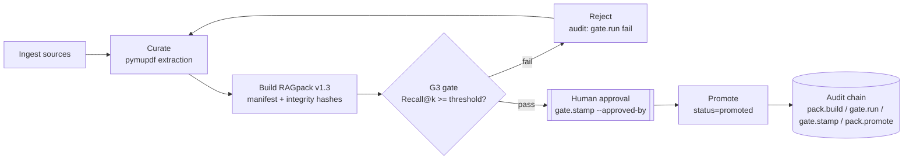
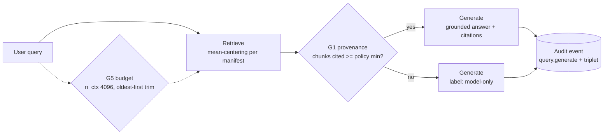
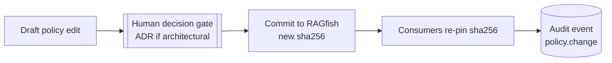

# BPMN v0.8 — Governed Processes

Two processes. Human tasks appear ONLY in P1 (promotion) and on policy changes — the runtime query path (P2) has zero human gates by design.

## P1: Pack build & promotion (Knowledge plane)

Changes vs v0.4 flow: G3 decision gate inserted before promotion; human approval is a stamped, audited task; every step emits chained events.

## P2: Runtime query (Runtime plane — spec now, enforcement v0.9)

Notes:
- G1 does not block generation; it forces honest labeling. Blocking mode is a policy option deferred to v0.9 discussion.
- G5 wraps the existing token-budget manager; no new runtime behavior, only policy-sourced parameters.

## P3: Policy change (Policy plane)

